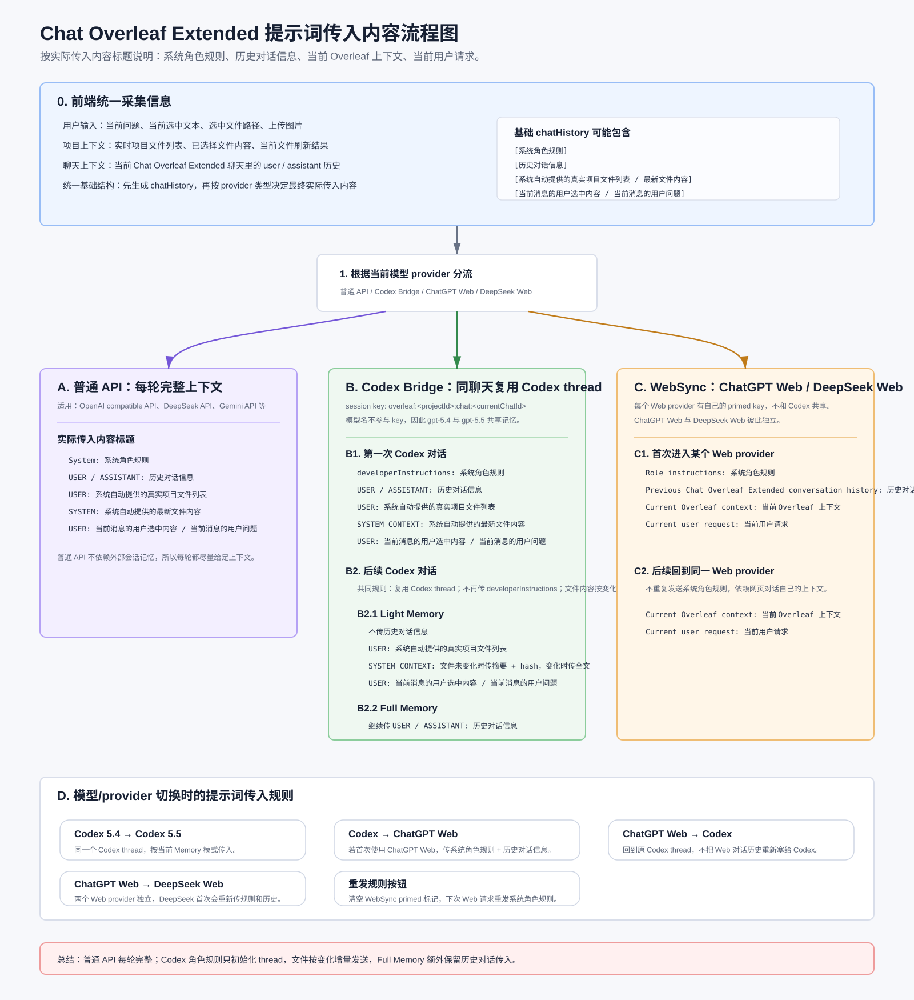

# Chat Overleaf Extended

本项目是 [anuin-cat/chat-overleaf](https://github.com/anuin-cat/chat-overleaf) 的 extended fork，在原项目基础上增加了新的模型调用方式：Codex provider、ChatGPT/DeepSeek Web provider; 优化了上下文管理规则以减少Token消耗。

## 原项目简介

原项目 Chat Overleaf 是一个基于 Plasmo 构建的浏览器扩展，用于在 Overleaf 页面中提供基于大语言模型的问答和写作助手。

原项目主要功能包括：

- 在 Overleaf 页面中打开侧边栏和LLM对话
- 支持选中编辑器文本后提问、润色
- 支持读取当前项目文件和文件树作为上下文
- 支持多模型供应商配置
- 支持图片输入
- 支持对话历史
- 支持根据LLM的输出的替换、插入、新建文件指令修改 LaTeX 文件

原项目地址：

https://github.com/anuin-cat/chat-overleaf

## 本版本新增功能

本版本在原项目基础上新增和调整了以下能力：

- 新增 Codex provider，可通过本地 Codex Bridge 使用已登录的 Codex / ChatGPT Plus / Pro 能力
- 新增 ChatGPT/DeepSeek Web provider，通过已登录的 ChatGPT/DeepSeek 网页进行 WebSync 桥接，可以让 Overleaf 插件中的提问和 ChatGPT/DeepSeek 网页版、和手机版对话同步。
- 为新的providers提供新的记忆管理和上下文模式，针对原项目基于 API 调用时每轮都需要重复传入系统角色规则、历史对话和上下文信息，导致 token 消耗较高的问题，本版本在 Codex 及 ChatGPT / DeepSeek Web 等具备会话记忆能力的 provider 中，尽量复用模型侧已有记忆，减少重复上下文传输：
   - 新增 Codex 记忆自检与复用机制：支持在同一 Overleaf 项目、同一聊天会话中复用同一条 Codex thread 记忆，并可通过自检确认记忆复用是否生效。
   - 新增 WebSync 首次和后续提问的记忆功能，支持同一对话切换 provider 时的上下文补发逻辑
- 新增长回答折叠 / 展开 UI

## 本版本使用方法

本节面向不熟悉代码和命令行的普通用户。推荐直接下载已经打包好的发布包，不需要 clone 项目，也不需要自己构建。

### 1. 下载发布包

打开下面的下载链接：

https://github.com/yuewangnb-eng/chat-overleaf/releases/download/v0.4.2-release.1/ChatOverleafExtended-Release.zip

如果上面的链接无法直接下载，也可以打开 Release 页面手动下载：

https://github.com/yuewangnb-eng/chat-overleaf/releases/tag/v0.4.2-release.1

在页面的 `Assets` 区域下载：

```text
ChatOverleafExtended-Release.zip
```

### 2. 解压文件

下载完成后，右键 `ChatOverleafExtended-Release.zip`，选择“全部解压”或“解压到当前文件夹”。

解压后会看到一个类似下面的文件夹：

```text
ChatOverleafExtended-Release
└─ ChatOverleafExtended
   ├─ install.bat
   ├─ install.ps1
   ├─ uninstall.ps1
   ├─ extension
   ├─ bridge
   └─ scripts
```

请不要只把 `extension` 文件夹单独拖走。建议把整个 `ChatOverleafExtended` 文件夹放在一个以后不会随便删除的位置，例如：

```text
D:\Tools\ChatOverleafExtended
```

### 3. 安装前准备

浏览器扩展本身可以加载后使用 API provider 或 Web provider；如果要使用 `Codex` provider，还需要本地 Codex Bridge。

安装脚本会自动检查以下内容：

- 是否安装了 Node.js
- 是否安装了 Codex CLI
- 是否注册了 `overleafgpt-codex://` 本地启动协议
- 是否能启动本地 Codex Bridge

如果电脑没有 Node.js，请先安装：

https://nodejs.org/

安装 Node.js 后，关闭当前安装窗口，再重新双击 `install.bat`。

### 4. 运行安装脚本

进入解压后的 `ChatOverleafExtended` 文件夹，双击：

```text
install.bat
```

脚本会打开一个命令行窗口，并自动执行安装辅助步骤。

如果 Windows 提示脚本被拦截，可以右键 `install.bat`，选择“以管理员身份运行”。通常不需要管理员权限；本项目主要写入当前用户自己的本地协议注册表项。

安装脚本完成后，会自动打开浏览器扩展管理页面和扩展目录。

### 5. 在 Chrome 或 Edge 中加载扩展

由于这是预览测试版，不是 Chrome Web Store / Edge Add-ons 商店版本，所以需要手动加载一次。

在浏览器扩展管理页面中：

1. 打开右上角“开发者模式”。
2. 点击“加载已解压的扩展程序”。
3. 选择解压包里的 `extension` 文件夹。

要选择的是这个文件夹：

```text
ChatOverleafExtended\extension
```

加载成功后，扩展列表中会出现：

```text
Chat Overleaf Extended
```

### 6. 在 Overleaf 中打开插件

打开 Overleaf 项目页面后，页面中会出现 Chat Overleaf Extended 的入口。打开侧边栏后，可以进入设置页面配置模型服务。

如果页面没有显示插件入口，请检查：

- 浏览器扩展是否已经启用
- 当前是否在 Overleaf 项目编辑页面
- 修改或重新加载扩展后，是否刷新了 Overleaf 页面

### 7. 使用 Codex provider

Codex provider 适合已经在本机登录 Codex / ChatGPT Plus / Pro 的用户。

首次使用前，请确认：

1. 已经安装并登录 Codex Desktop 或 Codex CLI。
2. 已经运行过本发布包里的 `install.bat`。
3. 浏览器扩展已经加载成功。

使用步骤：

1. 打开 Overleaf 项目。
2. 打开 Chat Overleaf Extended 侧边栏。
3. 进入设置页。
4. 在“模型服务”中选择 `Codex`。
5. 点击“连接到本地 Codex”。
6. 连接成功后即可在插件中提问。

如果提示“连接失败”，请重新运行解压包里的：

```text
install.bat
```

如果仍然失败，请查看：

```text
ChatOverleafExtended\logs\install.log
```

### 8. 使用 ChatGPT Web provider

ChatGPT Web provider 不需要 API key，也不使用 Codex Bridge。它会把插件中的问题转发到你已经登录的 ChatGPT 网页标签页，再把网页回答同步回 Overleaf 插件。

使用步骤：

1. 在浏览器中打开并登录 ChatGPT：

```text
https://chatgpt.com/
```

2. 回到 Overleaf 页面，打开 Chat Overleaf Extended 设置页。
3. 在“模型服务”中选择 `ChatGPT Web`。
4. 点击“打开 ChatGPT 网页”或“检测网页连接”。
5. 检测成功后，在插件中正常提问。

ChatGPT Web 使用网页当前选择的模型。需要切换模型时，请在 ChatGPT 网页里切换。

### 9. 使用 DeepSeek Web provider

DeepSeek Web provider 的逻辑和 ChatGPT Web 类似，也不需要 API key。

使用步骤：

1. 在浏览器中打开并登录 DeepSeek：

```text
https://chat.deepseek.com/
```

2. 回到 Overleaf 页面，打开 Chat Overleaf Extended 设置页。
3. 在“模型服务”中选择 `DeepSeek Web`。
4. 点击“打开 DeepSeek 网页”或“检测网页连接”。
5. 检测成功后，在插件中正常提问。

DeepSeek Web 使用网页当前选择的模型。需要切换模型时，请在 DeepSeek 网页里切换。

### 10. 使用 API provider

原项目已有的 API provider 仍然保留。你可以在设置页中继续配置 OpenAI、Gemini、DeepSeek、智谱、硅基流动等 API 服务。

这类 provider 通常需要你自己准备对应服务商的 API key，并在插件设置里填写。

### 11. 更新到新版本

后续如果发布了新版：

1. 下载新的 `ChatOverleafExtended-Release.zip`。
2. 解压到一个新的文件夹，或覆盖旧的 `ChatOverleafExtended` 文件夹。
3. 重新双击 `install.bat`。
4. 打开浏览器扩展管理页。
5. 点击 Chat Overleaf Extended 卡片上的“重新加载”。
6. 刷新 Overleaf 页面。

如果你把新版本解压到了不同路径，请务必重新运行 `install.bat`，否则“连接到本地 Codex”仍可能指向旧路径。

### 12. 卸载

在浏览器扩展管理页面中，移除 `Chat Overleaf Extended`。

如果使用过 Codex provider，还可以运行解压包里的：

```text
uninstall.ps1
```

它会移除本机的 `overleafgpt-codex://` 本地启动协议注册。

如果要停止正在运行的本地 Codex Bridge，可以在 PowerShell 中执行：

```powershell
Get-NetTCPConnection -LocalAddress 127.0.0.1 -LocalPort 17381 | Select-Object -ExpandProperty OwningProcess -Unique | ForEach-Object { Stop-Process -Id $_ }
```

### 13. 常见问题

**下载后 Windows 提示文件不安全怎么办？**

这是因为 zip 文件来自浏览器下载。可以右键 zip 文件，打开“属性”，如果看到“解除锁定”，勾选后再解压。

**双击 install.bat 后提示没有 Node.js 怎么办？**

先安装 Node.js：

https://nodejs.org/

安装完成后关闭安装窗口，再重新双击 `install.bat`。

**扩展页面加载哪个文件夹？**

选择解压包里的 `extension` 文件夹，不是整个 zip，也不是最外层文件夹。

**ChatGPT Web / DeepSeek Web 没有回复怎么办？**

确认对应网页已经登录，并且网页标签页保持打开。然后回到插件设置页点击“检测网页连接”。

**Codex 可以用，但设置页显示未连接怎么办？**

重新点击“连接到本地 Codex”。如果仍然失败，重新运行 `install.bat`，再刷新 Overleaf 页面。

**这个版本可以商用或公开分发吗？**

不建议。本版本是基于 [anuin-cat/chat-overleaf](https://github.com/anuin-cat/chat-overleaf) fork 的预览测试版本。上游项目目前未声明明确开源许可证，因此该版本仅建议用于个人测试或小范围试用，不建议公开商用分发。

## 新增功能说明

### Codex Provider

Codex provider 不使用服务商 API key，而是通过本地 Codex Bridge 调用用户本机已经登录的 Codex 环境，通过Codex Bridge 安全配对 token，避免任意本机网页直接调用 bridge，确保连接安全。

**基本流程：**

1. 用户在本机安装并登录 Codex。
2. 插件设置中选择 `Codex` provider。
3. 用户点击设置页中的“连接到本地 Codex”。
4. 扩展通过 `overleafgpt-codex://` 本地协议启动 Codex Bridge。
5. Codex Bridge 在本机调用 `codex app-server`。
6. Chat Overleaf Extended 将当前问题、上下文和必要的历史信息发送到本地 bridge。
7. bridge 将 Codex 的流式回答转换为 OpenAI Chat Completions 风格的响应返回给扩展。

**本地 Bridge 安全设计：**

Codex Bridge 默认只监听：
```text
127.0.0.1:17381
```
`/health` 端点保持公开，仅用于判断 bridge 是否正在运行，不返回 token、账号信息或登录凭据。

以下接口需要本地 bridge token：
- `/v1/models`
- `/v1/chat`
- `/v1/chat/stream`
- `/v1/codex/session/reset`
- `/v1/codex/memory-check`
- `/v1/codex/sessions`

1. 用户点击“连接到本地 Codex”。
2. 扩展生成一次性 `nonce`。
3. 扩展打开 `overleafgpt-codex://start?nonce=...`。
4. 本地启动脚本把 nonce 传给 bridge。
5. 扩展调用 `/v1/bridge/pair`。
6. bridge 校验 nonce。
7. 校验通过后返回本地 bridge token。
8. 扩展保存 token。
9. 后续 Codex 请求都会自动带上 `X-OverleafGPT-Bridge-Token`。

### ChatGPT Web / DeepSeek Web Provider

WebSync provider 独立于 API provider 和 Codex Bridge。

它不需要 API key，而是把 Chat Overleaf Extended 中的一次请求转发到已经登录的 ChatGPT 或 DeepSeek 网页标签页，再把网页生成的回答同步回 Chat Overleaf Extended。


### Codex/Web Providers 记忆方式及上下文管理

原项目主要基于 API 接口调用模型。为了让模型理解任务，每次请求通常都需要重新传入系统角色规则、选中文件内容和历史对话信息；当项目文件较多或对话较长时，这会造成明显的 token 消耗。

本版本优化了插件记忆管理和上下文传输逻辑。对于 Codex 和 ChatGPT / DeepSeek Web 这类具备会话记忆能力的 provider，插件会尽量利用模型侧已有的会话记忆，减少重复发送固定规则和历史上下文。

#### Codex 记忆方式及上下文管理
Codex Bridge 会按同一个 Overleaf 项目和同一个聊天会话复用同一条 Codex thread 记忆，并提供记忆自检能力，用于确认 thread 复用是否真的生效。

#### Web Providers 记忆方式及上下文管理
**首次**使用某个 Web provider 时，发送角色规则、历史对话、当前 Overleaf 上下文和当前用户请求。**后续**连续使用同一个 Web provider 时，只发送当前 Overleaf 上下文和当前用户请求。

#### 统一项目统一对话切换 providers 的记忆方式

- 切换 Codex 内的模型，例如从 `gpt-5.4` 切到 `gpt-5.5`，不会自动开启新的记忆；仍复用当前项目和当前聊天对应的 Codex thread。
- 从其他 provider 切回 Codex 提供两种上下文模式：
   - `Light Memory`：复用 Codex thread 后，不传入对话全部历史记录；
   - `Full Memory`：复用 Codex thread 的同时，每轮仍传入全部聊天历史；
- 从其他 provider 切回 Web provider 时，补发历史对话和当前上下文，避免网页侧忘记中间发生的对话。

**记忆管理流程图见：**




### 长回答折叠

当助手回答内容较长时，消息区域会显示“折叠回答 / 展开回答”按钮。默认仍展示完整回答，用户可手动折叠长回答以减少侧边栏占用空间。流式输出过程中不会显示折叠按钮，回答完成后才判断是否需要显示。


